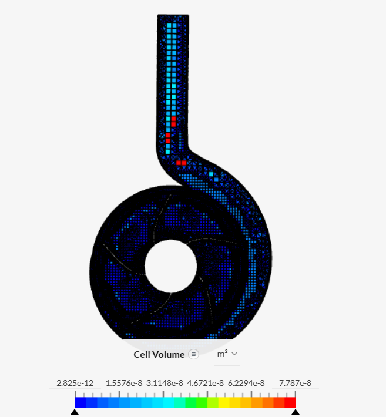
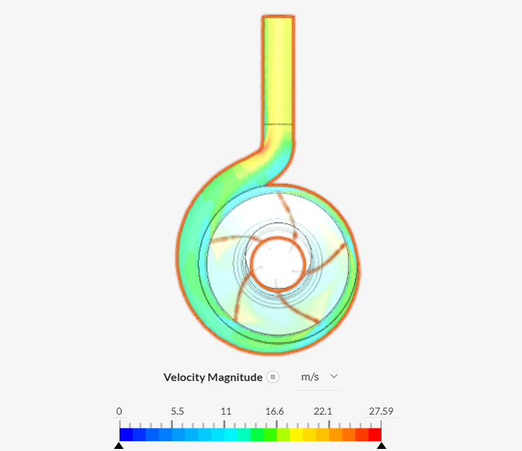
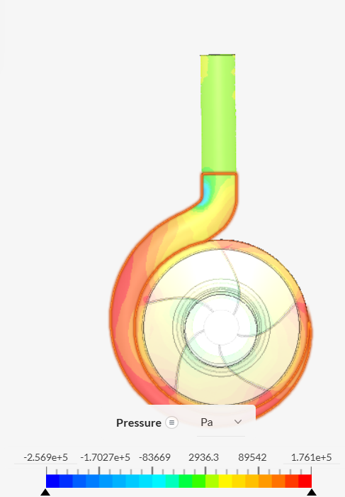
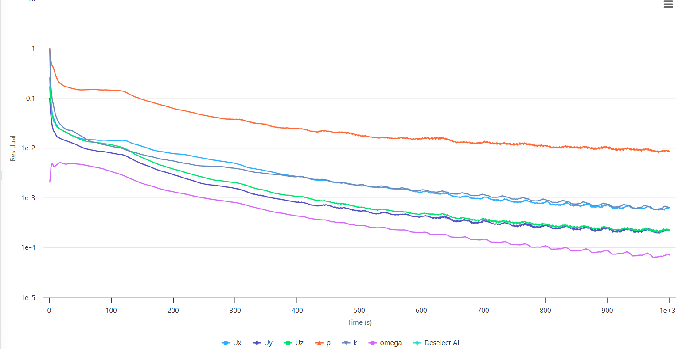

# Centrifugal Pump CFD Simulation Using SimScale

## 1. Project Overview

This project presents a Computational Fluid Dynamics (CFD) study of internal flow through a centrifugal pump geometry using SimScale.

The study investigates the velocity and pressure fields within the pump geometry and examines the computational mesh and numerical behavior of the solution.

The simulation workflow included geometry preparation, boundary-condition specification, turbulence modeling, mesh generation, numerical setup, simulation execution, and post-processing.

The pump geometry was obtained from an existing SimScale community project and used as the starting point for this study. The original geometry source is acknowledged in this repository. The simulation setup, post-processing, and interpretation documented here reflect the work performed for this study.

> **Important:** The model does not include a rotating reference frame or rotating region for the impeller. Therefore, the results should be interpreted as an investigation of the computed internal flow field rather than a validated prediction of centrifugal-pump performance.

---

## 2. Project Objectives

The main objectives of this study were to:

- Investigate velocity distribution within the pump geometry.
- Examine pressure distribution throughout the computational domain.
- Visualize internal flow behavior through the pump passages.
- Apply the k–ω SST turbulence model to an internal-flow problem.
- Generate and examine a computational mesh.
- Analyze solver residuals and numerical solution behavior.
- Identify limitations of the current modeling approach.
- Develop practical experience in CFD simulation and post-processing using SimScale.

---

## 3. Simulation Setup

| Parameter | Specification |
|---|---|
| **CFD Platform** | SimScale |
| **Working Fluid** | Water |
| **Flow Assumption** | Incompressible |
| **Turbulence Model** | k–ω SST |
| **Analysis Approach** | Steady-state |
| **Rotating Region** | Not configured |
| **Mesh Identifier** | Mesh 14 |
| **Number of Cells** | Approximately 1.6 million |
| **Number of Nodes** | Approximately 487,200 |
| **Inlet Flow Rate** | 8.5 × 10⁻³ m³/s |
| **Outlet Gauge Pressure** | 0 Pa |

The model was configured to investigate incompressible turbulent flow through the pump geometry.

---

## 4. Geometry and Boundary Conditions

The computational model uses a centrifugal-pump geometry containing internal passages associated with the impeller and volute.

### Boundary Conditions

| Boundary | Condition |
|---|---|
| **Inlet** | Volumetric flow rate |
| **Inlet Flow Rate** | 8.5 × 10⁻³ m³/s (8.5 L/s) |
| **Outlet** | Pressure outlet |
| **Outlet Gauge Pressure** | 0 Pa |
| **Solid Surfaces** | Wall |

The inlet flow rate was specified as:

\[
Q = 8.5 \times 10^{-3}\;m^3/s
\]

which corresponds to:

\[
Q = 8.5\;L/s
\]

The outlet gauge pressure was set to **0 Pa**.

A gauge pressure of 0 Pa represents pressure relative to the selected reference pressure and does not mean that the absolute pressure is zero.

---

## 5. Mesh Generation

The computational mesh was generated using the SimScale meshing workflow.

### Recorded Mesh Settings

| Mesh Parameter | Setting |
|---|---|
| **Mesh** | Mesh 14 |
| **Cells** | Approximately 1.6 million |
| **Nodes** | Approximately 487,200 |
| **Meshing Algorithm** | Standard |
| **Sizing** | Automatic |
| **Fineness** | 5 |
| **Curvature** | Automatic |
| **Physics-Based Meshing** | Enabled |
| **Hex Element Core** | Enabled |
| **Automatic Boundary Layers** | Disabled |
| **Automatic Extrusion Meshing** | Disabled |

### Mesh Visualization

The mesh provides the spatial discretization required to solve the governing flow equations.

The approximately 1.6 million-cell mesh provides a relatively detailed computational representation of the geometry. However, cell count alone does not establish mesh quality or mesh independence.

A more rigorous assessment would include mesh-quality metrics and comparison of key results across different mesh resolutions.

---

## 6. Numerical Setup

The recorded numerical settings included:

| Parameter | Setting |
|---|---|
| **Relaxation Type** | Manual |
| **Pressure Reference Cell** | 0 |
| **Pressure Reference Value** | 0 Pa |
| **Absolute Tolerance — Velocity** | 1 × 10⁻⁶ |
| **Absolute Tolerance — Pressure** | 1 × 10⁻⁶ |
| **Absolute Tolerance — k** | 1 × 10⁻⁶ |
| **Absolute Tolerance — ω** | 1 × 10⁻⁶ |
| **Potential Flow Initialization** | Enabled |
| **End Time** | 1,000 s |
| **Time Step** | 1 s |
| **Write Control** | Time step |
| **Write Interval** | 1,000 |
| **Decomposition** | Scotch |

The simulation completed successfully according to the SimScale event log, with a reported runtime of approximately **23 minutes** and **3.09 core-hours**.

The specified residual tolerances represent the solver's convergence criteria; they should not be interpreted as the residual values actually achieved during the simulation.

---

## 7. Results and Post-Processing

### 7.1 Velocity Magnitude

The velocity-magnitude contour illustrates the spatial distribution of flow speed throughout the modeled pump geometry.

The contour can be used to identify:

- Regions of relatively high velocity.
- Regions of lower velocity.
- Changes in flow speed through the internal passages.
- Non-uniformity in the computed flow field.
- Regions that may warrant further investigation for recirculation or flow separation.

Because no rotating region was configured, the velocity field should not be interpreted as a complete representation of the energy transfer normally produced by a rotating centrifugal-pump impeller.

---

### 7.2 Pressure Distribution

The pressure contour illustrates the computed pressure field throughout the modeled geometry.

The pressure distribution can be used to examine spatial pressure variations within the computational domain.

However, quantitative prediction of pump pressure rise or pump head requires an appropriate representation of impeller rotation and a suitable definition of inlet and outlet performance quantities.

---

### 7.3 Computational Mesh

The mesh visualization shows the discretization of the computational domain.

The mesh must adequately resolve curved passages, regions of high velocity gradients, and near-wall flow behavior for reliable CFD predictions.

---

### 7.4 Solver Residuals

The residual history shows an overall reduction in several monitored variables during the simulation.

The velocity and turbulence-variable residuals decrease toward the later stages of the run, while the pressure residual remains comparatively higher, at approximately the \(10^{-2}\) level near the end of the plotted interval.

Although the residuals decrease, not all variables reach the configured absolute tolerance of \(10^{-6}\).

Therefore, the residual history indicates an overall reduction in numerical error but does not, by itself, demonstrate complete numerical convergence.

Additional assessment using monitored engineering quantities and conservation checks would provide a stronger basis for evaluating convergence.

---

## 8. Engineering Discussion

The pressure and velocity contours provide qualitative insight into the internal flow behavior of the modeled centrifugal-pump geometry.

The velocity field illustrates spatial variations in flow speed, while the pressure field provides information about the distribution of pressure throughout the computational domain.

The mesh and residual histories provide additional information about the numerical representation and behavior of the simulation.

The results are particularly useful for developing practical understanding of:

- Internal turbulent flow.
- CFD preprocessing and meshing.
- Pressure and velocity post-processing.
- Residual behavior.
- Numerical convergence assessment.
- Limitations associated with simplified pump modeling.

---

## 9. Rotating Impeller Limitation

A centrifugal pump transfers mechanical energy to the fluid through the rotation of its impeller.

In this simulation, **no rotating region or rotating reference frame was configured**.

As a result, the current model does not explicitly represent the rotational energy transfer from the impeller to the fluid.

Therefore, the simulation should **not** be used to claim validated values of:

- Pump head
- Pump efficiency
- Shaft power
- Torque
- Pump performance curves
- Actual pressure rise generated by the rotating impeller

Instead, the current study should be presented as a **CFD investigation of the internal flow and pressure/velocity fields within the modeled pump geometry**.

A more complete centrifugal-pump analysis would require an appropriate rotating-machinery modeling approach and validation against pump-performance data.

---

## 10. Limitations and Future Work

The main limitations of the current study are related to the simplified representation of the rotating machinery and the available validation data.

Future work could include:

1. **Implement rotating machinery modeling**  
   Introduce an appropriate rotating region or rotating reference frame for the impeller.

2. **Perform mesh-independence testing**  
   Compare key flow quantities using coarse, medium, and fine meshes.

3. **Evaluate mesh quality**  
   Examine skewness, non-orthogonality, aspect ratio, and near-wall resolution where available.

4. **Perform a detailed convergence assessment**  
   Evaluate residuals together with monitored flow quantities, pressure differences, and mass conservation.

5. **Investigate flow structures**  
   Use streamlines and additional velocity visualizations to examine recirculation, separation, and flow development.

6. **Calculate pump performance parameters**  
   After implementing appropriate rotating machinery physics, calculate pump head, pressure rise, hydraulic power, and efficiency.

7. **Validate the CFD model**  
   Compare numerical predictions with experimental data, manufacturer pump curves, analytical calculations, or published reference data.

---

## 11. Geometry Acknowledgment

The centrifugal-pump geometry used in this study was obtained from an existing SimScale community project and was used as the starting geometry for the simulation.

The original geometry source is acknowledged to distinguish the geometry from the simulation work performed in this study.

If any additional elements of the original project were reused, such as the mesh, boundary conditions, solver settings, or simulation results, these should be identified separately.

---

## 12. Skills Demonstrated

- Computational Fluid Dynamics (CFD)
- SimScale
- Internal turbulent-flow analysis
- k–ω SST turbulence modeling
- CFD boundary-condition specification
- Computational mesh generation
- Pressure-field visualization
- Velocity-field visualization
- CFD post-processing
- Solver residual interpretation
- Numerical convergence assessment
- Identification of CFD modeling limitations
- Engineering interpretation of simulation results

---

## 13. Simulation Project

**SimScale Project:**  
https://www.simscale.com/projects/mehwish_akhtar/centrifugal_pump-coursera-_-_copy_258705908/

---

## 14. Conclusion

This project demonstrates the application of CFD to investigate internal flow behavior within a centrifugal-pump geometry using SimScale.

The study involved geometry preparation, boundary-condition specification, turbulence modeling, mesh generation, numerical setup, simulation execution, and post-processing.

The resulting pressure and velocity fields provide qualitative insight into the flow behavior within the modeled pump geometry. The residual history also provides an opportunity to assess the numerical behavior of the solution.

A key limitation is that the current model does not include an explicit rotating region for the impeller. Consequently, the results are not presented as validated predictions of centrifugal-pump performance.

Future development of the model with appropriate rotating-machinery physics, mesh-independence testing, convergence assessment, and validation against reference pump data would allow a more quantitative investigation of pump performance.

